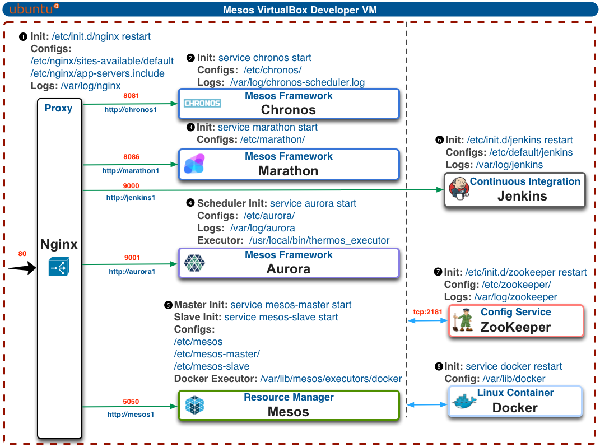

vagrant-mesos
=============

Vagrant dev environent setup with Mesos/Marathon/Aurora/Jenkins/Docker

### Setup ###

Run the following script which will launch 3 VMs each with all the components shown in the graphic above installed. To save time the script will install everything on the first VM, save it as a vbox image and then clone the remaining VMs from it.

	$ ./create.sh

#### Mesos master instance ####

	mesos1 ip address: 192.168.56.101

The main instance has the following services actively running upon startup and has 8GB allocated RAM:

	1. Mesos master
	2. Mesos slave
	3. Zookeeper
	4. Docker
	5. Docker Executor
	6. Jenkins
	7. Marathon

#### Additional VMs  ####

Your cluster now effectively has 3 Mesos masters, 3 zookeepers and 3 Mesos slaves (each with Docker installed). Jenkins, Marathon & Aurora are installed on the additional VMs too except that they have been disabled on startup. The additional Mesos instances have been allocated a lesser 2GB RAM each.

	mesos2 ip address: 192.168.56.102
	mesos3 ip address: 192.168.56.103

Each additional VM with the following services actively running upon startup:

	1. Mesos master
	2. Mesos slave
	3. Zookeeper
	4. Docker
	
#### /etc/hosts  ####

Create these entries in the /etc/hosts file on the host machine for quick access to the VMs.

	192.168.56.101	mesos1 jenkins1 marathon1 aurora1
	192.168.56.102	mesos2 jenkins2 marathon2 aurora2
	192.168.56.103	mesos3 jenkins3 marathon3 aurora3

An Nginx HTTP proxy server is running on each machine so that you can access the applications on the respective VMs. Only one Mesos master is active at a time so you will be immediately redirected to the leading master.

	Mesos - http://mesos1 | http://mesos2 | http://mesos3

Accessing Jenkins web UI:

	http://jenkins1

Accessing Marathon web UI

	http://marathon1

Accessing Aurora web UI (you will need to run /usr/local/aurora.sh first manually on mesos1)

	http://aurora1

#### Destroying VMs ####

Run the following script to destroy the VMs

	./destroy.sh